

  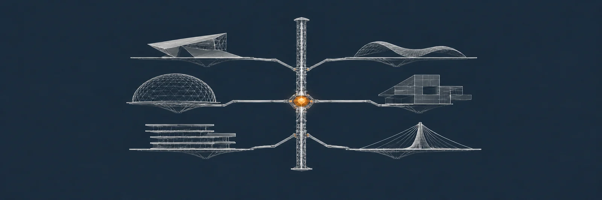

# J0UH

I build payment infrastructure around direct bank payments, programmable assets, always-on digital settlement, and agents that can operate financial workflows safely.

MoneyOS sits at the centre of that work. The aim is to bring banking and open-finance rails, programmable assets, on-chain settlement, and agent-driven payment operations into one coherent model without giving up control or evidence.

Alongside it, I am working on direct bank payments for ecommerce, apps, and merchant hardware. The customer authorises through their bank while the merchant gets clear payment state, recovery, and reconciliation without a card scheme or conventional gateway stack.

## What I am building now

<table>
<tr>
<td width="50%" valign="top">
   
  <strong><a href="https://github.com/J0UH/moneyos-platform">MoneyOS</a></strong> 
  Banking and open-finance rails, programmable assets, blockchain settlement, and agent-controlled payment workflows in one operating model.
</td>
<td width="50%" valign="top">
  <a href="https://github.com/J0UH/open-finance-payments">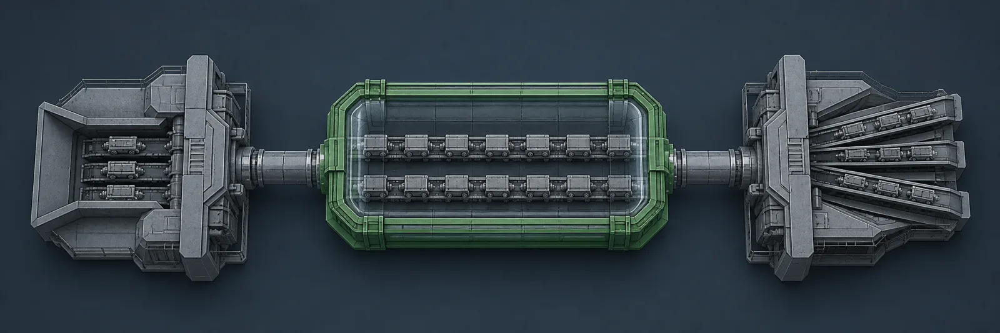</a> 
  <strong><a href="https://github.com/J0UH/open-finance-payments">Direct bank payments</a></strong> 
  Account-to-account checkout for ecommerce, apps, and merchant hardware, using bank authorisation without a card scheme or conventional gateway stack.
</td>
</tr>
<tr>
<td width="50%" valign="top">
  <a href="https://github.com/J0UH/stablecoin-factory">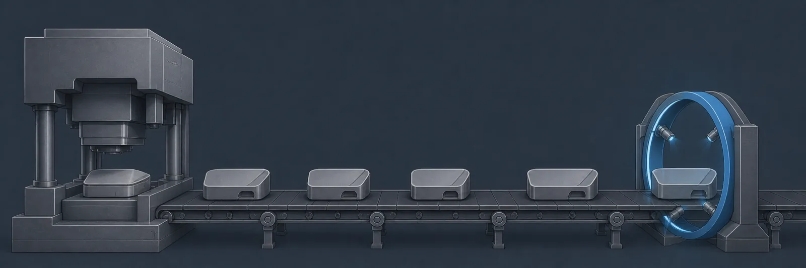</a> 
  <strong><a href="https://github.com/J0UH/stablecoin-factory">Programmable asset issuance</a></strong> 
  Controlled issuance for fiat-linked money, precious metals, commodities, and other tokenised capital-market assets.
</td>
<td width="50%" valign="top">
   
  <strong><a href="https://github.com/J0UH/token-bridge-sdk">Always-on digital settlement</a></strong> 
  Same-chain transfers, cross-chain routing, atomic exchange, and reconciliation between round-the-clock digital value and fiat accounts.
</td>
</tr>
<tr>
<td width="50%" valign="top">
  <a href="https://github.com/J0UH/personal-ai-employee">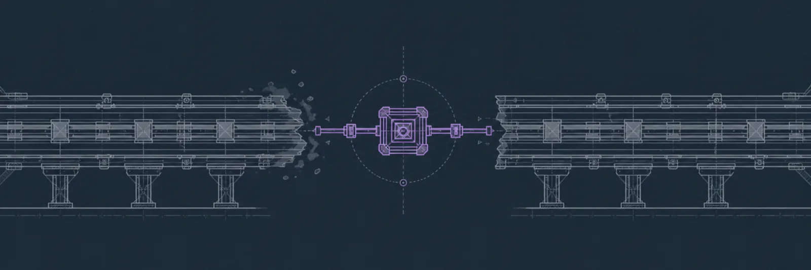</a> 
  <strong><a href="https://github.com/J0UH/personal-ai-employee">Personal AI employee</a></strong> 
  A persistent AI worker that can take assignments, continue over time, ask for decisions, and return checked outcomes.
</td>
<td width="50%" valign="top">
  <a href="https://github.com/J0UH/agentic-systems">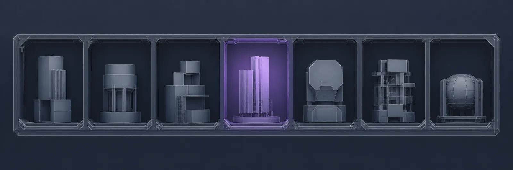</a> 
  <strong><a href="https://github.com/J0UH/agentic-systems">AI operations and orchestration</a></strong> 
  Agents that handle email, CRM updates, preparation, coordination, and follow-through for personal and business work.
</td>
</tr>
</table>

## Bounded automation and agent systems

Agents earn their place when they can keep useful work moving without hiding authority, evidence, or privacy. This work covers a persistent AI employee, verified code review, private companions, portable workflows, and project coordination.

| Capability | Project |
| --- | --- |
| Work that continues across interruptions | [Personal AI employee](https://github.com/J0UH/personal-ai-employee) |
| Review automation with persisted sign-off | [Verified code review assistant](https://github.com/J0UH/verified-code-review-assistant) |
| Memory, goals, preparation, and follow-through | [Life companion](https://github.com/J0UH/life-companion) |
| Private communication and meeting context | [Private communication companion](https://github.com/J0UH/private-communication-companion) |
| Useful workflows that survive a change of tool | [Portable agent capabilities](https://github.com/J0UH/portable-agent-capabilities) |
| Project state and human control | [Project intelligence and coordination](https://github.com/J0UH/project-intelligence-coordination) |

## More systems

<table>
<tr>
<td width="50%" valign="top">
  <a href="https://github.com/J0UH/agentic-systems">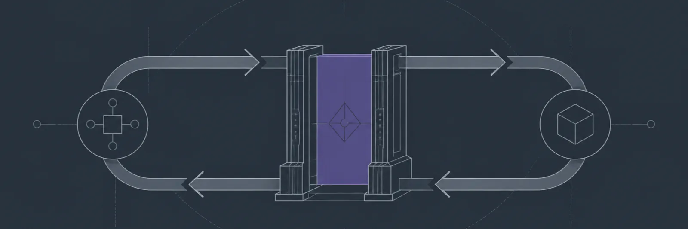</a> 
  <strong><a href="https://github.com/J0UH/agentic-systems">Agentic systems</a></strong> 
  Durable agents, controlled tools, memory, evaluation, and human authority in real operating environments.
</td>
<td width="50%" valign="top">
  <a href="https://github.com/J0UH/exchange-market-infrastructure">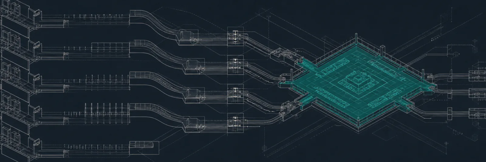</a> 
  <strong><a href="https://github.com/J0UH/exchange-market-infrastructure">Exchange and market infrastructure</a></strong> 
  DEX, CEX and DAX architecture, routing, liquidity, market data, orders, settlement, and operations.
</td>
</tr>
<tr>
<td width="50%" valign="top">
  <a href="https://github.com/J0UH/open-finance-payments">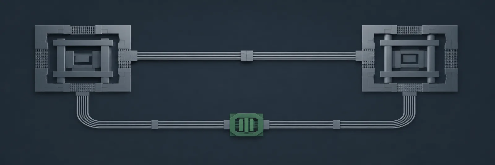</a> 
  <strong><a href="https://github.com/J0UH/open-finance-payments">Open finance and payments</a></strong> 
  Bank-to-bank payments, merchant products, credentials, webhooks, reconciliation, and integration experience.
</td>
<td width="50%" valign="top">
  <a href="https://github.com/J0UH/stablecoin-infrastructure">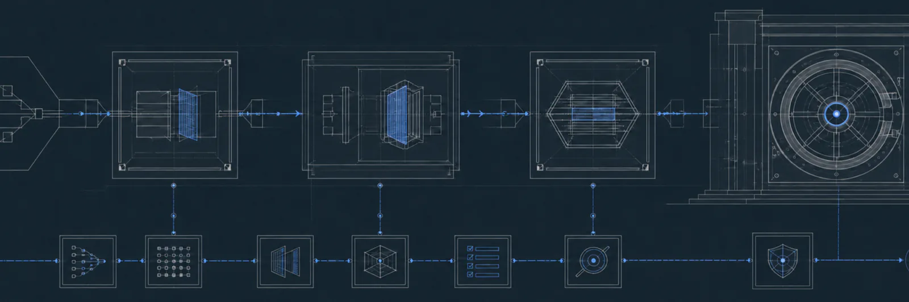</a> 
  <strong><a href="https://github.com/J0UH/stablecoin-infrastructure">Stablecoin and programmable asset infrastructure</a></strong> 
  Fiat-linked money, commodities, precious metals, digital cash, contract operations, vaults, settlement, and product controls.
</td>
</tr>
<tr>
<td width="50%" valign="top">
  <a href="https://github.com/J0UH/money-operations-systems">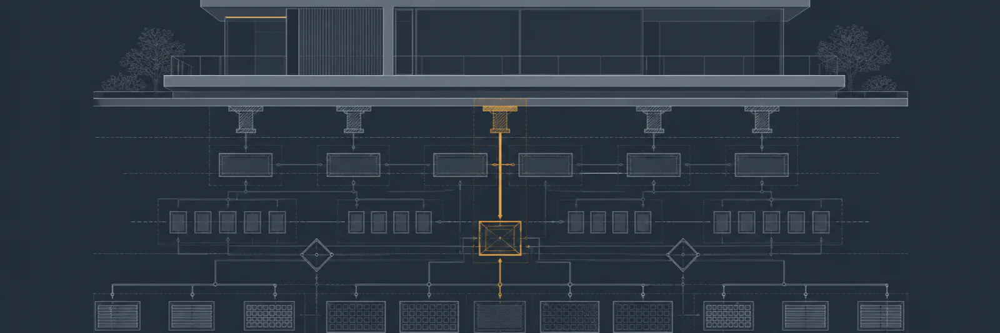</a> 
  <strong><a href="https://github.com/J0UH/money-operations-systems">Money and operations systems</a></strong> 
  ERP, CRM, treasury, reconciliation, work management, and the operating state behind financial products.
</td>
<td width="50%" valign="top">
  <a href="https://github.com/J0UH/product-engineering">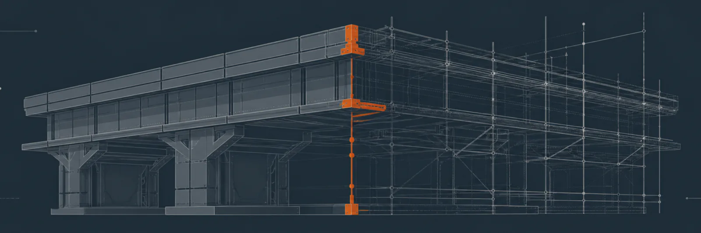</a> 
  <strong><a href="https://github.com/J0UH/product-engineering">Product engineering</a></strong> 
  Product architecture, interfaces, developer experience, delivery, documentation, and systems that survive production.
</td>
</tr>
</table>

## How I build

I start with the operating problem and the smallest version that creates real value. I am happy to cut scope. I will not hide state, authority, failure, or licence risk to make a system look simpler than it is.

- Build the useful path first and state its limits plainly.
- Put authority, evidence, and recovery into the design.
- Reuse existing technology when it fits, with proper credit and licence discipline.
- Stay close to the code, the people using it, and the people operating it.
- Let production teach the next iteration.

## Work with me

<table>
<tr>
<td width="38%" valign="top">
  
</td>
<td width="62%" valign="top">
  <strong>I like difficult systems with a useful outcome.</strong>  
  Payment infrastructure, programmable assets, digital settlement, and AI operations all become interesting at the point where product ambition meets real authority, evidence, and recovery.  
  Building something similar, or trying to untangle a system that already exists? <a href="mailto:ju@jomena.group?subject=A%20system%20worth%20building">Email me with the context</a>.  
  A personal site is planned. This profile is the portfolio until it is ready.
</td>
</tr>
</table>
