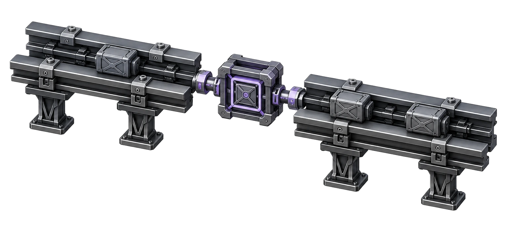
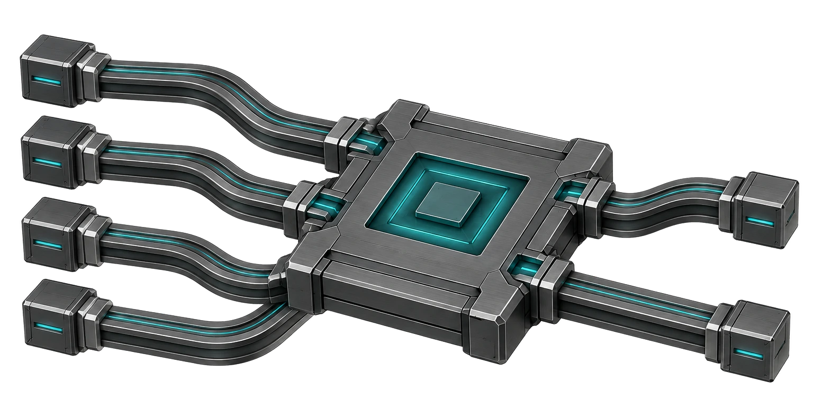
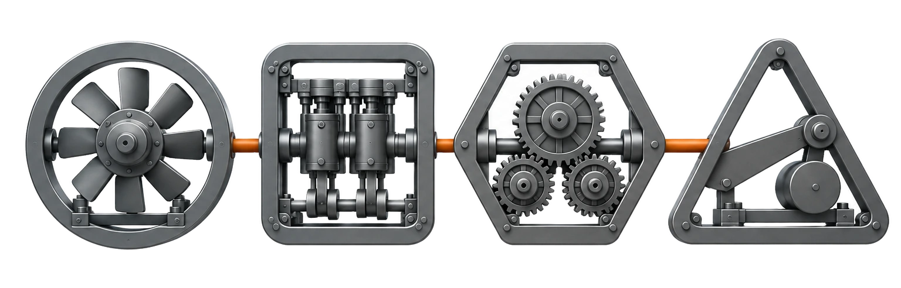
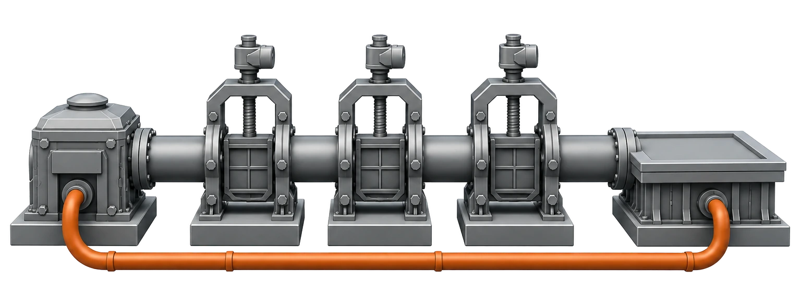

# I'm Jodi. I love a hard problem.

I build payment systems, AI workflows, and products that make complicated work easier to handle. I enjoy getting into the details, figuring out what is getting in the way, and trying an approach that makes things click.

Some work starts with an idea. Some starts with an existing system that needs to fit a different job. I like being close to the interface, the machinery underneath it, and the people who have to use and run it.

<picture>
  <source media="(prefers-reduced-motion: reduce)" srcset="assets/hero-v3.webp" />
  
</picture>

## What I'm building and exploring

### [MoneyOS](https://github.com/J0UH/moneyos-platform)

Bringing bank payments, programmable assets, and settlement into one system. My focus is keeping the financial record, the operator’s view, and AI-assisted workflows in step.

[Read the story](https://github.com/J0UH/moneyos-platform)

### [Personal AI employee](https://github.com/J0UH/personal-ai-employee)

An AI worker should be able to pick up where it left off. This personal project explores saved progress, decisions that stay with the assignment, and results checked before reporting completion.

[Read the story](https://github.com/J0UH/personal-ai-employee)

### [Exchange and market infrastructure](https://github.com/J0UH/exchange-market-infrastructure)

Following a trade from quote to settlement across venues, routes, and liquidity. I work on the interfaces, integrations, and operator tools that explain each step and help resolve exceptions.

[Read the story](https://github.com/J0UH/exchange-market-infrastructure)

### [Cadence](https://github.com/J0UH/cadence-work-management)

A quieter way for small teams to plan sprints and keep their commitments visible. Cadence preserves ownership and change history, so moving a task doesn’t lose the reason behind it.

[Read the story](https://github.com/J0UH/cadence-work-management)

### [Digital sales systems](https://github.com/J0UH/digital-sales-systems)

Interactive product pages that explain how complex technology works and where it fits. I combine visual design, reusable content, and engineering to help a reader decide what to explore next.

[Read the story](https://github.com/J0UH/digital-sales-systems)

### [Developer platform and delivery](https://github.com/J0UH/developer-platform-delivery)

A clear path from a product change to a running release. My work covers APIs, deployment automation, and the observations and recovery tools needed when something goes wrong.

[Read the story](https://github.com/J0UH/developer-platform-delivery)

More projects and experiments

### [Open finance and payments](https://github.com/J0UH/open-finance-payments)

- [Direct bank payments for merchants](https://github.com/J0UH/open-finance-platform)

- [Wallet and integration SDK](https://github.com/J0UH/wallet-integration-sdk)

### [Stablecoin and programmable asset infrastructure](https://github.com/J0UH/stablecoin-infrastructure)

- [Programmable asset issuance](https://github.com/J0UH/stablecoin-factory)

- [Digital cash platform](https://github.com/J0UH/digital-cash-platform)

- [Vault and liquidity systems](https://github.com/J0UH/vault-liquidity-systems)

- [Always-on blockchain settlement](https://github.com/J0UH/token-bridge-sdk)

- [Asset-backed product interfaces](https://github.com/J0UH/asset-backed-products)

- [Stablecoin as a service](https://github.com/J0UH/stablecoin-service-platform)

- [Smart contract operations](https://github.com/J0UH/smart-contract-operations)

### [Exchange and market infrastructure](https://github.com/J0UH/exchange-market-infrastructure)

- [Decentralised exchange platform](https://github.com/J0UH/dex-platform)

- [Smart order routing](https://github.com/J0UH/smart-order-routing)

- [Market data and indexing](https://github.com/J0UH/market-data-indexing)

- [Limit order infrastructure](https://github.com/J0UH/limit-order-infrastructure)

- [CEX and DAX platform adaptation](https://github.com/J0UH/cex-platform-adaptation)

- [Multi-asset money platform](https://github.com/J0UH/multi-asset-money-platform)

- [Trading and treasury automation](https://github.com/J0UH/trading-treasury-automation)

### [Money and operations systems](https://github.com/J0UH/money-operations-systems)

- [Financial ERP](https://github.com/J0UH/financial-erp)

- [CRM and relationship operations](https://github.com/J0UH/crm-operations)

- [Operational control planes](https://github.com/J0UH/operational-control-planes)

- [MoneyOS](https://github.com/J0UH/moneyos-platform)

- [Cadence work management](https://github.com/J0UH/cadence-work-management)

### [Agentic systems](https://github.com/J0UH/agentic-systems)

- [Project intelligence and coordination](https://github.com/J0UH/project-intelligence-coordination)

- [ERP assistant](https://github.com/J0UH/ai-erp-agent)

- [AI agent marketplace](https://github.com/J0UH/ai-agent-marketplace)

- [Verified code review assistant](https://github.com/J0UH/verified-code-review-assistant)

- [Personal AI employee](https://github.com/J0UH/personal-ai-employee)

- [Private communication companion](https://github.com/J0UH/private-communication-companion)

- [Life companion](https://github.com/J0UH/life-companion)

- [Portable agent capabilities](https://github.com/J0UH/portable-agent-capabilities)

### [Product engineering](https://github.com/J0UH/product-engineering)

- [Workflow automation infrastructure](https://github.com/J0UH/workflow-automation-infrastructure)

- [Developer platform and delivery](https://github.com/J0UH/developer-platform-delivery)

- [Product web platform](https://github.com/J0UH/product-web-platform)

- [Developer documentation and content systems](https://github.com/J0UH/developer-docs-content)

- [Regulated product portals](https://github.com/J0UH/regulated-product-portals)

- [RYZE Furnace](https://github.com/J0UH/ryze-furnace-system)

- [Digital sales systems](https://github.com/J0UH/digital-sales-systems)

- [Technology adaptation and orchestration](https://github.com/J0UH/technology-adaptation)

## How I approach the work

I start with the problem and look for a useful first version. I am happy to cut scope, take an idea apart, or use an existing foundation when it fits. The decisions that matter should stay understandable to the next person who has to work with the result.

The project pages describe what each piece of work involves, the decisions behind it, and the foundations it builds on. They are public accounts of the work; the implementation and private operating details stay out of these repositories.

## Let's build something useful

If you are working on a difficult problem, I would like to hear about it. [Tell me what you are building](mailto:ju@jomena.group?subject=Something%20worth%20building).
